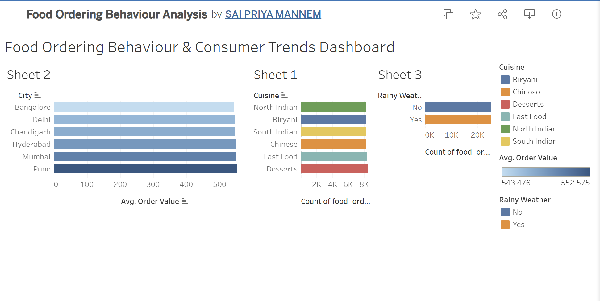

# 📈 Food Ordering Behaviour and Consumer Trends: A Structured Analysis of Choices and Habits

An advanced data analytics solution built using **Tableau** to evaluate consumer behavior patterns, revenue mechanics, and logistics performance within a modern food delivery ecosystem.

🔗 **Interactive Live Dashboard:**  
https://public.tableau.com/views/FoodOrderingBehaviourConsumerTrendsDashboard/Dashboard1?:showVizHome=no

---
## 📊 Dashboard Preview

---

# 🌐 Executive Summary

This enterprise-grade intelligence dashboard translates raw food delivery logs into actionable operational insights. By merging multi-dimensional demographic and spatial data, the project surfaces critical efficiency metrics to optimize platform growth and customer retention.

### Key Analytical Pillars:
- **Operational Efficiency:** Mapping delivery time distributions and performance bottlenecks.
- **Consumer Intelligence:** Decoupling order preferences by company dynamics and age brackets.
- **Financial Performance:** Tracking cross-city revenue shares and core business KPIs.

---

# 🚀 Strategic Objectives

- **Spatial Mapping:** Detect hyper-local demand peaks across major metro areas.
- **Cuisine Mapping:** Trace customer affinity trends for targeted menu enhancements.
- **Demographic Penetration:** Segment target markets based on age-group behaviors.
- **Financial Optimization:** Analyze category-wise revenue yield to support pricing models.
- **Logistics Auditing:** Assess delivery pipelines to maximize operational speed.

---

# 📊 Core Business KPIs

The dashboard aggregates business-critical metrics at a high-level glance:

- **📦 Volume Metric:** Total Order Counter
- **💰 Revenue Metric:** Comprehensive Value Generated
- **🚚 Logistics Cost:** Aggregate Delivery Fees
- **⭐ Quality Indicator:** Average Consumer Rating

---

# 🔍 Interactive Modules & Breakdowns

### 📐 1. Executive Scorecard
Maintains continuous visibility over baseline business metrics, tracking core totals, operational overheads, and consumer sentiment scores.

---

### 📐 2. Order Profile Breakdown (Company & Meal Context)
Examines cross-sections between situational ordering (Individual, Family units, Social gatherings) and meal categories (Breakfast, Mid-day, Prime Dinner hours, and Quick Snacks).

---

### 📐 3. Regional Cuisine Matrices
An interactive analytical matrix cross-referencing major regional hubs with prominent cuisine variations.
- **Target Regions:** Mumbai, Bangalore, Delhi, Hyderabad, Chandigarh, Pune
- **Food Profiles:** Biryani, Chinese, Desserts, Fast Food, North Indian, South Indian

---

### 📐 4. High-Volume Regional Hubs
A clean Pareto-style ranking system highlighting top geographical markets driving platform volume to dictate marketing focus.

---

### 📐 5. Consumer Preference Distribution
A streamlined proportional chart rendering instant visual breakdowns of cuisine performance percentages globally.

---

### 📐 6. Generational Behavior & Vendor Segments
Maps strategic marketing cohorts (Gen Z, Millennials, Mature Adults, Children) against specific restaurant categories.

---

### 📐 7. Meal Type Revenue Shares
A dedicated yield chart separating monetary contributions by daytime windows to discover high-value opportunities.

---

### 📐 8. Fulfillment and Delivery Pipelines
Traces delivery time distributions to expose transit delays and support operational streamlining.

---

# ⚡ Analytical Controls

To provide deep dive capabilities, the dashboard utilizes dynamic user controls:
- Market Region Filter
- Cuisine Segment Selector
- Meal Category Slider
- Merchant Type Filter

---

# 🛠 Tech Stack & Capabilities

- **Platform:** Tableau Desktop & Tableau Public Cloud
- **Data Layer:** Structured Excel / CSV Datasets
- **Domain Focus:** Business Intelligence (BI), Visual Storytelling, Dashboard Design, Advanced Calculated Fields, Parametric Filters.

---

# 📁 Repository Framework

food-ordering-consumer-trends/
│
├──  Food Ordering Behaviour & Consumer Trends Dashboard.twbx

├──  Food Ordering Behavior and Consumer Trends Story.twbx

├──  food_ordering_behavior_dataset.xlsx

├──  dashboard-preview.png

└──  README.md

---

# 👥 Project Team & Collaboration

### 👑 Project Lead
- **Modharapalem Chandana**

### 👨‍💻 Engineering & Analytics Team
- **Nalabolu Sreeja**
- **Gowthami Maddina**
- **Mannem Sai Priya**
- **Pathipati Mohitha**

---

# ⭐ Acknowledgments

If this analysis helped you or provided inspiration for your BI portfolio, please drop a ⭐ on this repository!

---

# 📄 Terms of Use

Developed strictly for academic presentation, portfolio evaluation, and data science training purposes.
